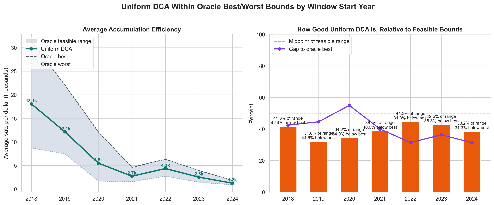
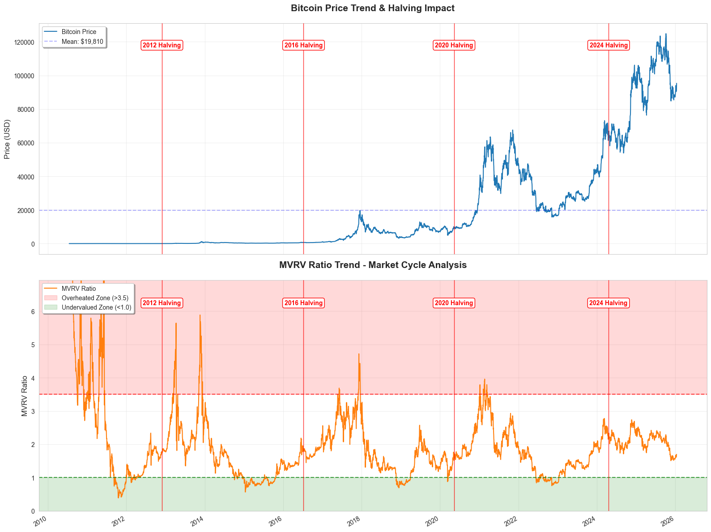

# Background

## Why This Problem Matters

This project treats Bitcoin accumulation as a capital allocation problem rather than a price-forecasting problem. The practical question is simple: if an investor already intends to accumulate Bitcoin over time with a fixed budget, can that budget be deployed more efficiently than a rigid equal-dollar schedule without abandoning discipline? That framing matters because it shifts attention away from predicting every price move and toward designing a rule that improves average entry quality across repeated accumulation windows.

Improving accumulation efficiency matters because even modest timing advantages can compound when capital is deployed systematically over long horizons. For a long-only investor, the difference between buying evenly on every date and buying more aggressively during stronger accumulation conditions can translate into meaningfully better sats-per-dollar outcomes without changing the overall budget. In that sense, the problem is closer to execution design than to directional trading.

## Why Uniform DCA Is the Right Baseline

Uniform DCA is easy to explain. It makes no hidden judgment calls. Every day receives the same allocation, so any improvement from a dynamic strategy has to come from a clearly defined decision rule rather than from opaque leverage, shorting, or discretionary overrides. This keeps the research honest: the goal is not to outperform an artificially weak benchmark, but to improve on a baseline that many real accumulators would actually use.

*Figure B-F1. Uniform DCA viewed against the best-possible and worst-possible accumulation outcomes within each rolling-window year. The left panel shows that uniform DCA usually sits well above the worst timing outcome, which helps explain why it is practical and robust. The right panel shows that it still captures only about one-third to mid-forty-percent of the feasible range in most years and remains materially below the oracle best, which is exactly why it is understandable and executable without being optimal.*

## Building a Decision System

The project is best understood as a decision-system problem. Predicting price is only one possible route to better accumulation, and not necessarily the most reliable one. A useful accumulation model does not need to forecast exact returns or local tops and bottoms. It needs to transform available information into an allocation rule that decides when to stay near baseline and when to increase conviction.

That is why the research focuses on identifying signals such as valuation, market regime, exchange-flow pressure, network demand, and cycle timing, then translating them into an interpretable rule for when to stay near baseline and when to increase conviction. These are the components of a decision system. They determine how evidence is converted into capital deployment within a rolling budget.

*Figure B-F2. The project treats accumulation as a decision system: multiple sub-signals are transformed into a confidence score, and that score is judged by how it relates to future outcomes rather than by standalone price prediction claims.*

## Interpretation Requirement

Interpretability is a requirement, not a convenience. In a capital allocation setting, a model should be understandable enough that its behavior can be inspected, challenged, and revised when it fails.

Transparent allocation logic also increases the value of negative findings. The team was able to learn from failed additions such as NVT or weak Polymarket overlays precisely because the model structure remained readable. When signals overlap, underperform, or create path-dependent allocation issues, those problems can be diagnosed only if the rule system is explicit enough to inspect. In that sense, progress in this project depends not only on better results, but also on whether each change can be explained in economic and mechanical terms.
