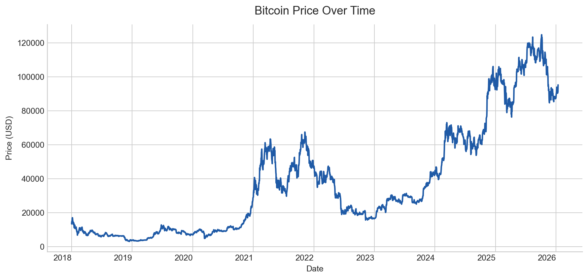
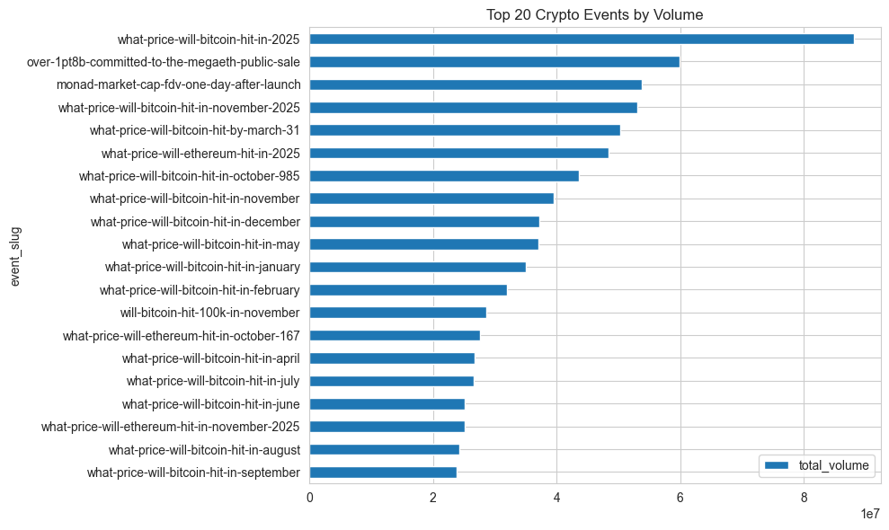

# Data

## Data Sources

| Source | Data provider | Frequency | Main contribution | Final-model role |
| --- | --- | --- | --- | --- |
| CoinMetrics | [Coin Metrics](https://coinmetrics.io/) | Daily | BTC price, valuation, exchange flow, supply, activity, cycle context | Core retained data source |
| Polymarket | [Polymarket Data API](https://data-api.polymarket.com) | Event / trade / odds time series | Event-sensitive overlays and exploratory external sentiment proxies | Exploratory only |

### CoinMetrics

The primary dataset for the project was the daily CoinMetrics Bitcoin series. It provided the core price and on-chain context used throughout modeling and backtesting.

At the repository level, CoinMetrics is also the source of truth for BTC-USD pricing in the backtest framework. The `PriceUSD` field is the benchmark reference price for evaluating accumulation efficiency against uniform DCA. Beyond price, the dataset includes the on-chain variables used to build valuation, flow, supply, activity, and cycle-related signals.

The modeling and backtesting workflow operates on a daily horizon across the repository's main evaluation range of 2018-01-01 through 2025-12-31. Not every field was retained, but the dataset as a whole provided the daily environment from which the final signal set was engineered.

*Figure D-F1. A simple view of Bitcoin's daily USD price path over the main modeling horizon. This is the base price series on top of which the repository's CoinMetrics-derived signals are constructed.*

### Polymarket

The secondary dataset came from Polymarket market data, especially finance-, politics-, and crypto-related markets that could plausibly reflect event-sensitive sentiment relevant to Bitcoin. Unlike CoinMetrics, Polymarket played an exploratory role rather than serving as the structural base of the final model.

The Polymarket data includes market metadata, token mappings, trades, odds history, event summaries, and market summaries. In this project, those records were transformed into higher-level overlays such as `crypto`, `trump`, and `us_affairs` for early-stage signal testing.

One implementation detail matters for reproducibility: some Polymarket parquet timestamps are stored with incorrect units and can appear corrupted if read naively. The repository loaders correct these timestamp issues at runtime, so analysis should use the provided loaders rather than raw direct reads.

