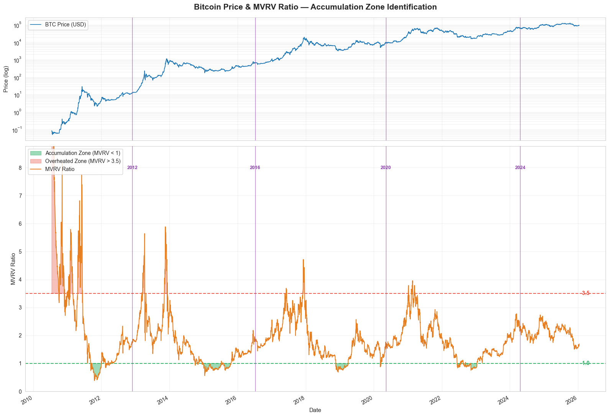
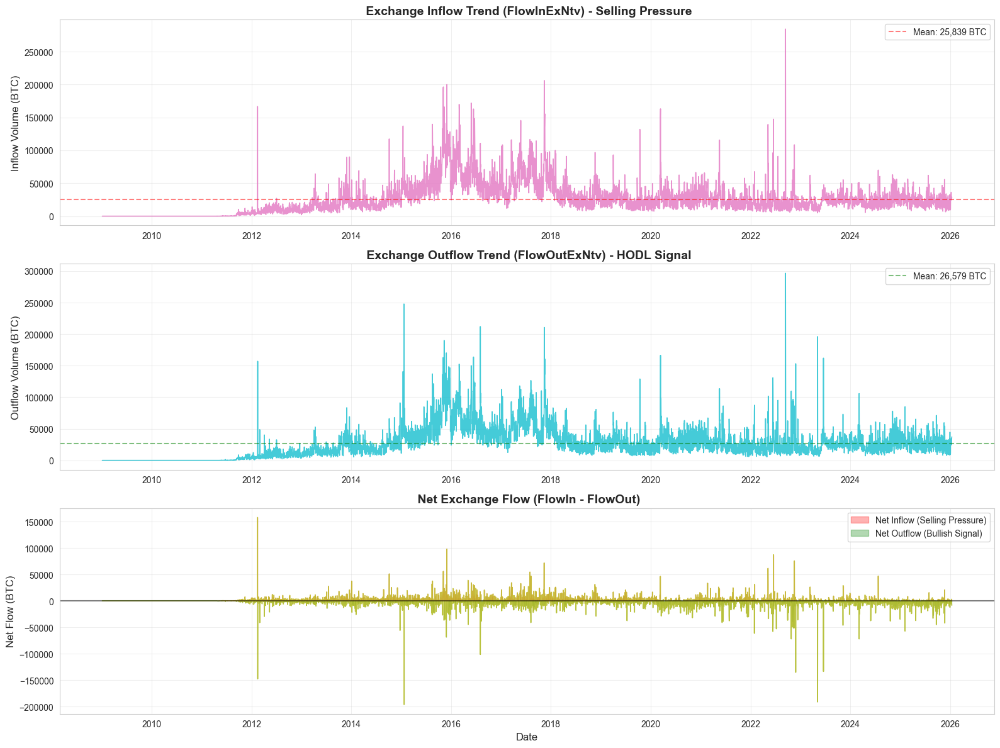
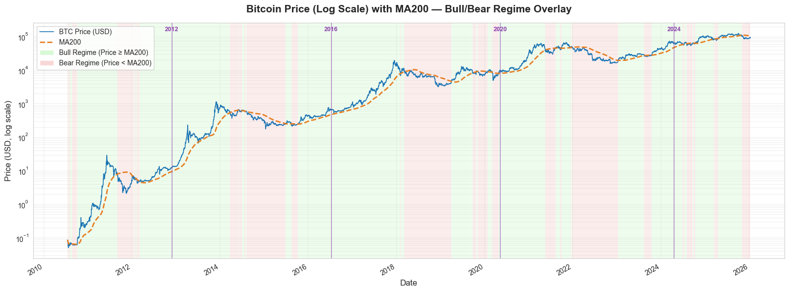
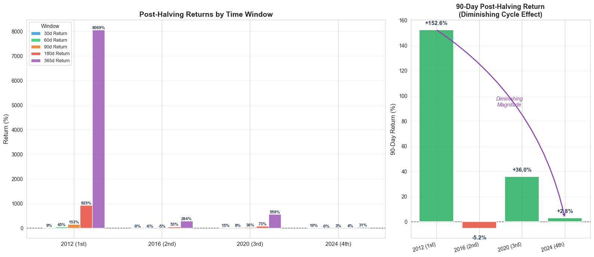
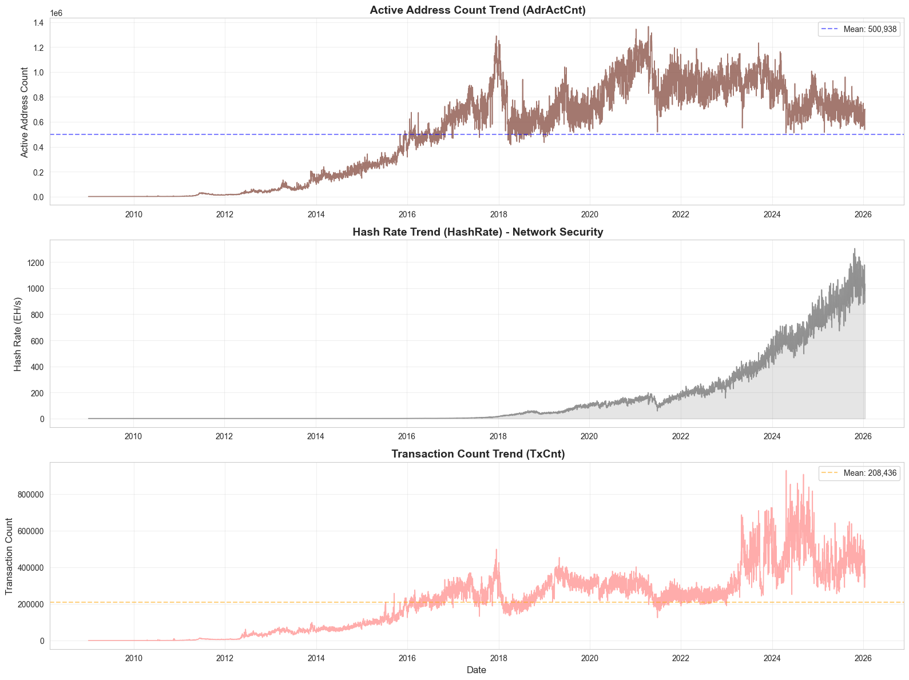
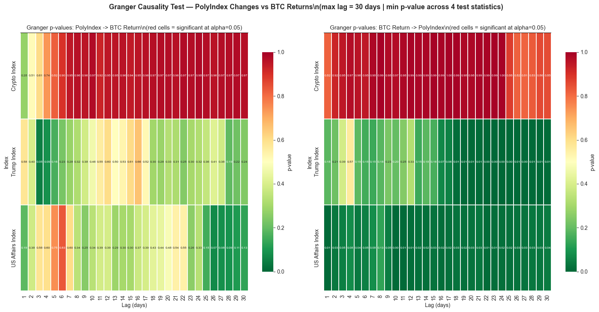

# EDA

The exploratory analysis was used to identify candidate signal families, uncover possible redundancy, and define which hypotheses were worth formal testing.

## Feature Families

The exploratory work grouped candidate signals into four broad families.

- **Valuation.** `mvrv_z`, `mvrv_zone`
- **Flow.** `FlowInExNtv`, `FlowOutExNtv`, `SplyExNtv`, `flow_signal`
- **Demand / activity.** `AdrActCnt`, `TxCnt`, `HashRate`
- **Market structure / external signals.** `price_vs_ma`, `halving_signal`, `poly_crypto`, `poly_trump`, `poly_us_affairs`

These families summarize the main decision channels identified in EDA rather than the final model specification. At this stage, the goal was to decide which fields looked worth testing as separate sources of information for accumulation timing. Later modeling was responsible for sorting these candidates into three groups: fields that added independent value, fields that turned out to be redundant, and fields that looked interesting in exploration but did not justify retention in the final decision model.

## Valuation Signal Evidence

Valuation was one of the clearest themes in the exploratory work. Among the available inputs, MVRV emerged as the strongest candidate for identifying when Bitcoin looked relatively cheap or expensive compared with its own realized value history. This made it attractive for a DCA setting because the decision problem was not to predict exact short-term price moves, but to decide when accumulation should become more aggressive or more cautious.

EDA showed that valuation matters, but not in exactly the same way all the time. Very high or very low MVRV levels seemed more useful than normal fluctuations, so the signal appeared to work differently depending on the market environment.

*Figure E-F1. MVRV valuation zones helped show why valuation emerged as one of the strongest early candidates for accumulation timing.*

## Flow Signal Evidence

Exchange-related features formed the second major group of promising signals. Exchange flow was attractive because it offered an interpretable bridge between on-chain behavior and market pressure. Sustained inflows to exchanges could be read as cautionary, while outflow-heavy periods aligned more naturally with accumulation behavior. This made flow information a good complement to valuation rather than a substitute for it.

*Figure E-F2. Exchange-flow behavior provided a second economic channel beyond valuation. It supported the idea that accumulation timing could improve when valuation signals were combined with interpretable supply-pressure information.*

MA200 also looked useful at this stage. As a trend or regime lens, it helped separate below-trend accumulation periods from weaker accumulation periods and stronger momentum periods. That made it a reasonable early modeling candidate even though it was not ultimately retained in the final architecture.

*Figure E-F3. MA200 regime shading provided an interpretable market-state view in exploration, which is why it remained a credible early candidate even before later simplification work.*

Halving proximity also remained useful in EDA, not as a day-to-day trading signal, but as a cycle-timing input. In the context of Bitcoin accumulation, that was sufficient. The project did not need every signal to operate at the same horizon, only to contribute interpretable information that improved the timing of capital deployment across rolling windows.

External signals also appeared interesting enough to test. In particular, Polymarket-derived indexes looked like plausible event-sensitive overlays during exploration, even though EDA alone could not establish whether they would add value beyond the on-chain base.

*Figure E-F4. Post-halving return patterns suggested that cycle position could matter even if it was not a short-horizon trading signal. That made halving proximity a reasonable feature to carry forward as a cycle-timing hypothesis.*

## Demand And Activity Evidence

Activity-based signals were also promising in EDA, especially those tied to network participation. The intuition was straightforward: if demand for the network is strengthening, then that demand may contain incremental information beyond what valuation alone can capture. This theme later became important in Step 3, where active-address style information was the first additional feature family to generate a clear improvement after the baseline.

## External Signal Evidence

Polymarket-derived features were initially reasonable candidates in EDA because they offered a different kind of information from the on-chain set. Instead of valuation, flow, or network participation, they potentially captured event-sensitive market sentiment and political or macro attention. That made them interesting enough to test, especially as a secondary overlay on top of an already interpretable on-chain base model.

To evaluate this properly, the team ran a baseline Polymarket overlay experiment using the same EDA-driven on-chain base and then added `crypto`, `trump`, `us_affairs`, and several combinations of those indexes.

| Variant | Score | Win rate | Mean excess | Readout |
| --- | --- | --- | --- | --- |
| `base` | **58.83%** | 67.34% | **+3.84%** | Strongest overall baseline |
| `base+crypto` | 58.73% | 67.93% | +3.36% | Slightly higher win rate, weaker edge |
| `base+trump` | 57.30% | 66.21% | +3.14% | Clearly weaker than base |
| `base+us_affairs` | 58.24% | 67.38% | +3.53% | Close, but still below base |
| `base+crypto+us_affairs` | 58.82% | **68.28%** | +3.40% | Best win rate, but not best overall |
| `base+crypto+trump` | 58.19% | 67.46% | +3.25% | No meaningful improvement |
| `base+trump+us_affairs` | 58.08% | 67.23% | +3.34% | Trump still weakens result |
| `base+crypto+trump+us_affairs` | 58.38% | 67.70% | +3.33% | No useful synergy from combining all three |

None of the overlay variants improved both score and mean excess over the base model. The `base+crypto+us_affairs` configuration slightly increased win rate, but its overall edge remained below the base model. Trump-related variants were consistently weaker, and combining all three Polymarket indexes did not create a stronger synergistic result.

The working hypothesis was that Polymarket activity might act as a leading indicator for Bitcoin regime or price. EDA and the early overlay experiments did not support that view. In practice, Polymarket looked more reactive than predictive: BTC moves appeared to lead changes in Polymarket activity, not the reverse. Because these overlays did not improve the on-chain base in a meaningful way, Polymarket was excluded from the later decision model.

*Figure E-F5. Polymarket sentiment was visually interesting enough to justify testing, but exploratory plausibility alone was not enough. Later benchmark comparisons showed that these overlays did not improve the on-chain base model in a meaningful overall way.*

## Redundancy And Overlap Evidence

EDA showed that some of the strongest-looking signals were actually overlapping views of the same market condition. The clearest case was MA200 and valuation structure. Both helped identify favorable accumulation environments, but later tests showed that they overlapped enough that keeping both as direct model inputs reduced efficiency. This became an important lesson for the project. A signal can still be useful in EDA because it helps interpret market conditions, but that does not mean it should remain in the final model if another signal already captures most of the same decision value. This also helps explain why the model improved after simplification. The gains came not from keeping every promising-looking signal, but from retaining the inputs that contributed genuinely independent information.

## Final EDA Implications

The main outcome of EDA was a practical shortlist for modeling. Valuation, flow, network demand, and cycle timing all looked strong enough to carry forward as candidate decision signals, while MA200 raised an early redundancy concern and Polymarket remained only an exploratory overlay.

That is the handoff point to the Modeling Journey page. EDA answered what looked worth testing. Modeling then answered which candidates actually survived once they were forced into a common backtested allocation framework.
