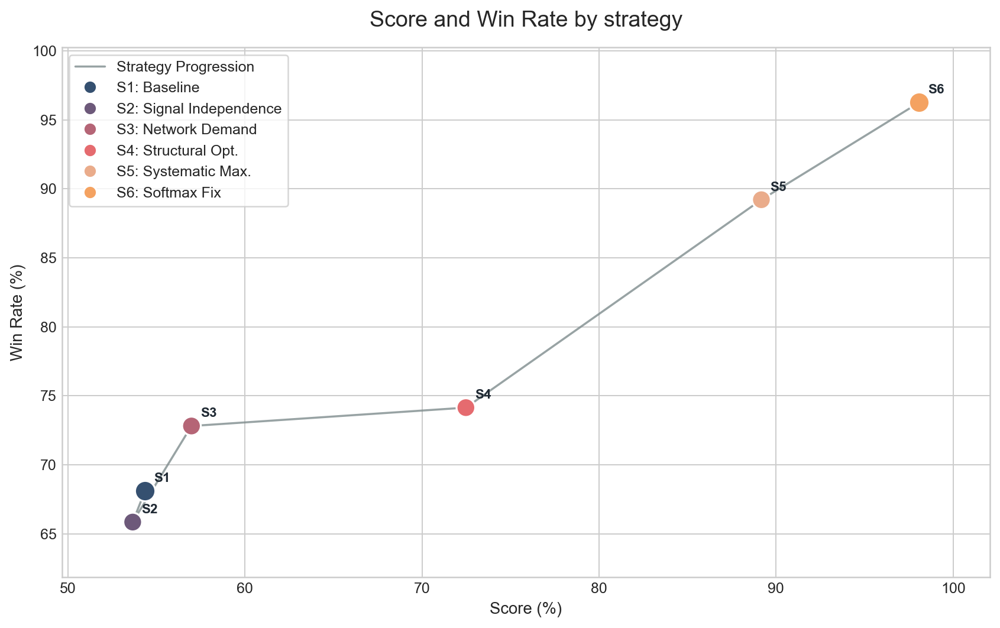

# Strategy Journey

We began with a baseline strategy and then refined it through experiments that added or removed candidate signals as their value became clearer. In the final stage, the main improvement came from optimizing the allocation mechanism itself.

## Strategy Performance Comparison

| Strategy | Score | Win Rate | Exp % |
|-------|------:|----------:|-------:|
| 1. Baseline Foundation | 54.36% | 68.13% | 40.59% |
| 2. Signal Independence Lesson | 53.66% | 65.86% | 39.58% |
| 3. Network Demand Discovery | 56.98% | 72.82% | 41.14% |
| 4. Structural Optimization | 72.48% | 74.15% | 70.81% |
| 5. Systematic Maximization | 89.17% | 89.21% | 89.13% |
| 6. Softmax Allocation  | 98.08% | 96.25% | 99.92% |

*Figure-11. The six-strategy progression moves from the lower-left baseline region toward the upper-right frontier, showing that both score and win rate improved as the strategy design was refined.*

### Strategy 1: Baseline Foundation

**Question**: Can EDA-validated signals alone beat uniform DCA?

**Approach**

- 4 core signals: MVRV Z-score, MA200 deviation, Halving proximity, Net exchange flow
- Simple weighted combination with exponential amplification (STR=2.0)

**Key Insight**: Simple, well-chosen on-chain signals are powerful.

---

### Strategy 2: Signal Independence Lesson

**Question**: Does adding NVT (Network Value to Transactions) improve performance?

**Approach**

- Add NVT Proxy z-score (W=0.10) as 5th signal
- NVT = Market Cap / On-chain transaction volume

**Key Insight**: More signals ≠ better performance. Signal independence matters more than signal count.

---

### Strategy 3: Network Demand Discovery

**Question**: Can network activity (active addresses) enhance strategy performance?

**Approach**

- Add AdrActCnt (Active Address Count) ratio signal
- Weight optimization: W=0.20 found optimal (vs 0.10 or 0.30)
- Network demand > long-term average → buy signal

**Key Insight**: On-chain network demand is a valid leading indicator.

---

### Strategy 4: Structural Optimization

**Question**: Can we improve structure, not just add signals?

**Approach**

- Grid Search A: Combine Net Flow + SplyExNtv (exchange balance) → +1.74%
- Grid Search B: Remove MA200 (r=0.87 correlation with MVRV) → +2.64%
- Grid Search C: Increase EXP_STRENGTH to 175 → +0.21%
- Final: 4 signals (MVRV, Halving, Flow composite, AdrActCnt)

**Key Insight**: Removing redundant signals (MA200) beats adding new ones.

---

### Strategy 5: Systematic Maximization

**Question**: How far can systematic hyperparameter optimization push the model's performance?

**Approach**

- Optuna hyperparameter search: 1000 trials, 16 parameters
- Multi-timescale z-scores: z30, z90, z180, z365, z1461
- Regime-aware MVRV: Different weights for bear (0.184) vs bull (0.011) markets
- Sigmoid architecture: Steepness + threshold for fine control

**Key Insight**: Systematic exploration, regime awareness, and multi-timescale signals drove a substantial performance gain.

---

### Strategy 6: Softmax Allocation

**Question**: What if the allocation mechanism itself is fundamentally broken?

**Root Cause Discovery**

- Allocate_sequential_stable BUG: In mega_bull windows, signal transitions sharply
  from "buy" to "don't buy". The sequential allocator gives low-signal days ~0 weight,
  and the LAST day absorbs 99.7% of surplus budget — at the MOST EXPENSIVE price.
- This caused 276 losses in Strategy 5, concentrated in mega_bull windows (82% WR).

**Approach**

- Replace allocate_sequential_stable with direct softmax normalization:
  `w_i = exp(steepness × composite_i) / Σ exp(steepness × composite_j)`
- Passes validation: wrapper uses pre-computed global features_df → masking input is a no-op
- Same features as Strategy 5 (proven on-chain + z-scores), retuned with Optuna TPE (1000 trials)

**Optimal Parameters** (Trial 910 / 1000 TPE trials)

- `steepness = 457.37` (softmax temperature, sharper allocation than Trial 189's 205)
- `base_w = 0.700` (on-chain dominant over z-scores: 70%)
- `w_addr = 0.742` (AdrActCnt remains dominant signal)
- `w_flow = 0.193`, `w_mvrv_bull = 0.184` (balanced flow & bull-MVRV)
- `w_ex = 0.045` (exchange supply nearly zeroed out)

**Result**: Score **98.08%**, WR **96.25%**, Exp **99.92%** — Only 96 losses out of 2,557 windows

**Key Insight**: The bottleneck was never signal quality; it was the sequential allocation
mechanism. A simple normalization change (softmax) delivered the final improvement after five rounds
of feature engineering.